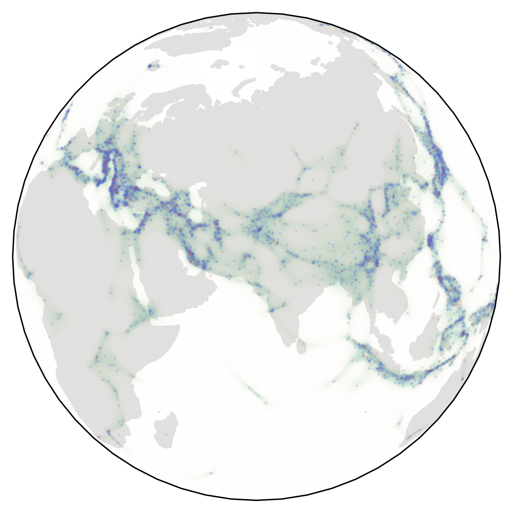
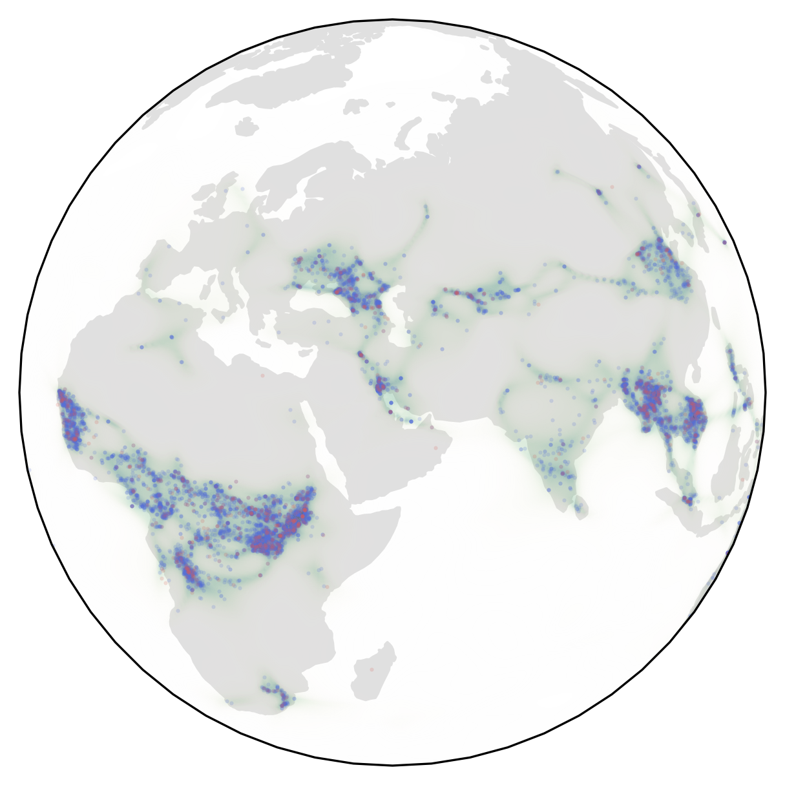

# Riemannian Score-Based Generative Modelling
[](https://openreview.net/forum?id=oDRQGo8I7P) [](https://arxiv.org/abs/2202.02763)
## Install
This repo requires a modified version of [geomstats](https://github.com/geomstats/geomstats) that adds jax functionality, and a number of other modifications. This can be found [here](https://github.com/oxcsml/geomstats.git ) on the branch `jax_backend`.

Simple install instructions are:
```
git clone https://github.com/oxcsml/score-sde.git
cd score-sde
git clone --single-branch --branch jax_backend https://github.com/oxcsml/geomstats.git 
virtualenv -p python3.9 venv
source venv/bin/activate
pip install -r requirements.txt
pip install -r requirements_exps.txt
pip install -e geomstats
pip install -e .
```

- `requirements.txt` contains the core requirements for running the code in the `score_sde` and `riemmanian_score_sde` packages. NOTE: you ma need to alter the jax versions here to match your setup.
- `requirements_exps.txt` contains extra dependencies needed for running our experiments, and using the `run.py` file provided for training / testing models. 
- `requirements_slurm.txt` contains extra dependencies for using the job scheduling functionality of hydra.
- `requirements_dev.txt` contains some handy development packages.

## Run experiments
Experiment configuration is handled by [hydra](https://hydra.cc/docs/intro/), a highly flexible `ymal` based configuration package. Base configs can be found in `config`, and parameters are overridden in the command line. Sweeps over parameters can also be managed with a single command.

Jobs scheduled on a cluster using a number of different plugins. We use Slurm, and configs for this can be found in `config/server` (note these are reasonably general but have some setup-specific parts). Other systems can easily be substituted by creating a new server configuration.

The main training and testing script can be found in `run.py`, and is dispatched by running `python main.py [OPTIONs]`.

### Logging
By default we log to CSV files and to [Weights and biases](wandb.ai). To use weights and biases, you will need to have an appropriate `WANDB_API_KEY` set in your environment, and to modify the `entity` and `project` entries in the `config/logger/wandb.yaml` file. The top level local logging directory can be set via the `logs_dir` variable.

### S^2 toy
To run a toy experiment on the sphere run:
`python main.py experiment=s2_toy`
This should validate that the code is installed correctly and the the RSGM models are training properly.
### Earth datasets
We run experiments on 4 natural disaster experiments against a number of baselines.
|                           | Volcano                 | Earthquake              | Flood                  | Fire                    |
|:--------------------------|:------------------------|:------------------------|:-----------------------|:------------------------|
| Mixture of Kent | $-0.80_{\pm 0.47}$ | $0.33_{\pm 0.05}$ | $0.73_{\pm 0.07}$ | $-1.18_{\pm 0.06}$ |
| Riemannian CNF            | $\bm{-6.05_{\pm 0.61}}$ | ${0.14_{\pm 0.23}}$     | ${1.11_{\pm 0.19}}$    | $\bm{-0.80_{\pm 0.54}}$ |
| Moser Flow                | ${-4.21_{\pm 0.17}}$    | $\bm{-0.16_{\pm 0.06}}$ | $\bm{0.57_{\pm 0.10}}$ | $\bm{-1.28_{\pm 0.05}}$ |
| Stereographic Score-Based | ${-3.80_{\pm 0.27}}$    | $\bm{-0.19_{\pm 0.05}}$ | ${0.59_{\pm 0.07}}$    | $\bm{-1.28_{\pm 0.12}}$ |
| Riemannian Score-Based    | ${-4.92_{\pm 0.25}}$    | $\bm{-0.19_{\pm 0.07}}$ | $\bm{0.48_{\pm 0.09}}$ | $\bm{-1.33_{\pm 0.06}}$ |

Examples of densities learned by RSGMs on the datasets:
| Volcano--- | Earthquake | Flood----- | Fire------ |
|:-|:-|:-|:-|
|  |  |  |  |

To run the full sweeps over parameters used in the paper run:

`RSGM ISM loss`:
```
python main.py -m \
    experiment=volcano,earthquake,fire,flood \
    model=rsgm \
    generator=div_free,ambient \
    loss=ism \
    flow.N=20,50,200 \
    flow.beta_0=0.001 \
    flow.beta_f=2,3,5 \
    steps=300000,600000 \
    seed=0,1,2,3,4
```
`RSGM DSM loss`:
```
python main.py -m \
    experiment=volcano,earthquake,fire,flood \
    model=rsgm \
    generator=div_free,ambient \
    loss=dsm0 \
    loss.thresh=0.0,0.2,0.3,0.5,0.8,1.0 \
    loss.n_max=-1,0,1,3,5,10,50 \
    flow.beta_0=0.001 \
    flow.beta_f=2,3,5 \
    seed=0,1,2,3,4
```
`Stereo RSGMs:`
```
python main.py -m \
    experiment=volcanoe,earthquake,fire,flood \
    model=sgm_stereo \
    generator=ambient \
    loss=ism \
    flow.beta_0=0.001 \
    flow.beta_f=4,6,8 \
    seed=0,1,2,3,4
```
`Moser flows`:
```
python main.py -m \
    experiment=volcanoe,earthquake,fire,flood \
    model=moser \
    loss.hutchinson_type=None \
    loss.K=20000 \
    loss.alpha_m=100 \
    seed=0,1,2,3,4
```
`CNF`:
```
python main.py -m \
    experiment=volcanoe,earthquake,fire,flood \
    model=cnf \
    generator=div_free,ambient \
    steps=100000 \
    flow.hutchinson_type=None \
    optim.learning_rate=1e-4 \
    seed=0,1,2,3,4
```

### High dimension torus example
To demonstrate the scaling of our method to high dimension manifolds we train RSGMs on products of circles to give high dimension toruses. We compare to the performance of Moser flows, the next most scalable method.


The commands to run the experiments shown in the plots are:
`RSGMs`:
```
python main.py -m \
    experiment=tn \
    n=1,2,5,10,20,50,100,200 \
    architecture.hidden_shapes=[512,512,512] \
    loss=ism,ssm \
    seed=0,1,2
```
`Moser flows`:
```
python main.py -m \
    experiment=tn \
    n=1,2,5,10,20,50,100,200 \
    model=moser \
    loss.hutchinson_type=None,Rademacher \
    loss.K=1000,5000,20000 \
    loss.alpha_m=1 \
    architecture.hidden_shapes=[512,512,512] \
    seed=0,1,2
```


### SO(3) toy
To demonstrate that RSGMs can handle conditional modelling well, we train ... 

`RSGMs, Stereo RSGMs`
```
python main.py -m \
    experiment=so3 \
    model=rsgm,sgm_exp \
    dataset.K=16,32,64 \
    steps=100000 \
    optim.learning_rate=5e-4,2e-4 \
    flow.beta_f=2,4,6,8,10 \
    seed=0,1,2,3,4
```
`Moser flows`
```
python main.py -m \
    experiment=so3 \
    model=moser \
    dataset.K=16,32,64 \
    steps=100000 \
    optim.learning_rate=5e-4,2e-4 \
    loss.K=1000,10000 \
    loss.alpha_m=1,10,100 \
    seed=0,1,2,3,4
```